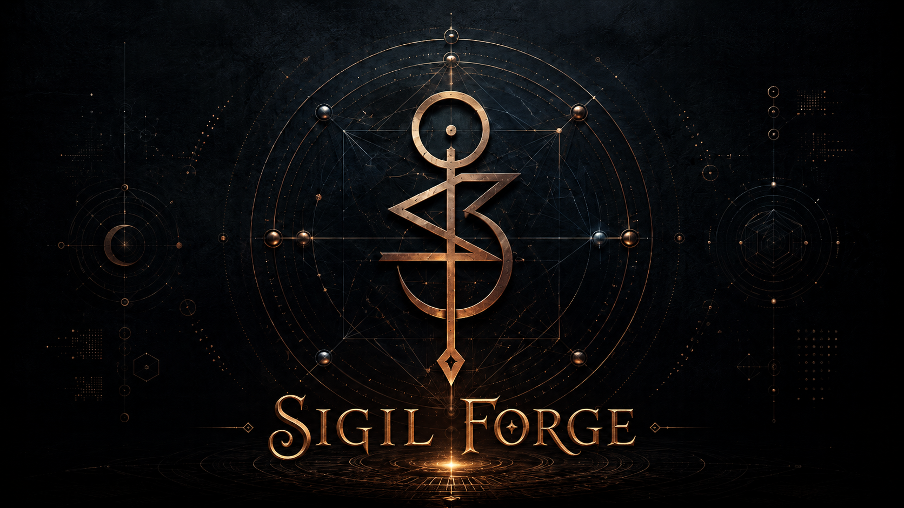

# Sigil-Forge

<p align="center">
  
</p>

<p align="center">
  <strong>v0.12.5</strong> · Hermes skill · offline-first · verifiable · MIT · proof-of-intent
</p>

**Sigil-Forge** turns a statement of intent into a **multi-channel sigil**: a procedural master glyph (SVG + PNG), a forge packet with method ontology and digests, steganographic carriers, optional device wallpapers, and a guided **wizard** for Hermes agents.

Default framing is a **creative / focus tool** (clarify, compress, externalize). Optional **`practice`** mode uses practitioner-oriented language without efficacy claims. Construction is **offline-first** — no image API required.

> Methods are craft history, symbolic compression, and data embedding — not proof of metaphysics. Never claims the sigil “works” or replaces professional help.

---

## Features

| Area | What ships |
|------|------------|
| **Wizard** | Step runner (`--next`), quick/full paths, sessions, per-step help |
| **Craft** | Spare monogram, kamea paths, Hebrew Rose Cross, bind-runes (`modern_derivation`) |
| **Encodings** | `hebrew_gematria` (default), `latin_extended`, `latin_mod9_v1` |
| **Planetary** | Traditional seal + intelligence/spirit; plate strokes → name_on_kamea → reconstruct |
| **Stego** | SVG multi-channel + PNG LSB (digest-only on public media) |
| **Wallpapers** | Immutable glyph + atmosphere; procedural / operator / host AI |
| **Ops** | construct, verify, verify-proof, inspect, open (`--capsule`), receipts, ledger, policy, doctor, eval, check |
| **Privacy** | Optional sealed packet; no plaintext intent in public carriers by default |
| **Proof of Intent** | Commitment, capsule, `sigil_root`, SF11, knowledge proofs, optional Noir/risc0 (v0.12.3+) |
| **Hermes packaging** | Skill (not plugin); `install.sh` + `check`/`doctor`/`eval` gates; progressive refs (v0.12.5) |

**Not included (by design):** Goetic/Enochian authority seals in the default forge (hard refuse via construct/wizard + `policy check`), efficacy claims, auto-canon learning, cloud image APIs inside the skill.

---

## Install

```bash
# Preview
bash install.sh --dry-run

# Default → ~/.hermes/skills/sigil-forge
bash install.sh

# Custom location
bash install.sh --target /path/to/skills/sigil-forge

# Version
bash install.sh --version
```

**Requirements:** Python 3.10+ (stdlib). No pip packages for the core path. Optional: `jsonschema` for stricter packet validation; optional `argon2-cffi` for Argon2id sealing.

From a clone without installing:

```bash
python3 scripts/sigil_forge.py check
python3 scripts/validate_hermes_skill.py   # Hermes frontmatter hygiene
```

---

## Quick start — wizard (recommended for Hermes)

Hermes has no multi-page UI. The wizard is a **step runner**: one question per turn, then apply.

```bash
# 1) Start a session (quick path: intent → mode → wallpaper)
python3 scripts/sigil_forge.py wizard --session-new --path quick

# 2) Each user answer — ask ONLY next.step, then merge
python3 scripts/sigil_forge.py wizard --next --session <id> \
  --answers-json '{"intent":"I maintain calm focus"}'

# 3) When next.done is true → forge
python3 scripts/sigil_forge.py wizard --apply answers.json \
  --path quick --out out/sigil-forge

# 4) Verify
python3 scripts/sigil_forge.py verify out/sigil-forge/*/glyph.svg
```

| Path | Audience | Steps |
|------|----------|--------|
| **`quick`** | Most users | intent, mode, wallpaper (+ surface/mode/theme if yes) |
| **`full`** | Craft options | + encoding, square, planetary seal/geometry, spare, phonetic, polish, seal_packet |

Unanswered optional fields use defaults on apply. Bad intents return `refused: true` early (no artifacts).

```bash
python3 scripts/sigil_forge.py wizard --script --path quick   # full contract JSON
python3 scripts/sigil_forge.py wizard --list-corpus           # planetary names/numbers
python3 scripts/sigil_forge.py wizard --interactive --path quick  # human TTY
```

Details: [references/wizard.md](references/wizard.md) · agent contract: [SKILL.md](SKILL.md)

---

## Expert construct

```bash
python3 scripts/sigil_forge.py construct \
  --intent "I maintain calm focus" \
  --mode creative \
  --kamea-encoding hebrew_gematria \
  --out out/sigil-forge

python3 scripts/sigil_forge.py verify out/sigil-forge/*/glyph.svg
python3 scripts/sigil_forge.py verify out/sigil-forge/*/glyph.png
```

### Useful flags

```bash
# Kamea encoding + square
--kamea-encoding hebrew_gematria|latin_extended|latin_mod9_v1
--square saturn|jupiter|mars|sol|venus|mercury|luna   # or omit for auto

# Planetary character (opt-in; ≠ intent kamea path)
--planetary-seal
--planetary-seal-kind traditional_seal|intelligence_character|spirit_character
--planetary-geometry auto|plate|name_on_kamea|reconstruction

# Spare family
--spare-mode letter_monogram|pictorial|automatic_drawing|mantric_alphabet|phonetic_mantric
--phonetic

# Privacy (prefer env over --passphrase — argv is visible in ps)
export SIGIL_FORGE_PASSPHRASE='operator-secret'
--seal-packet
--kdf auto                    # Argon2id if installed, else PBKDF2
--proof commitment            # capsule + sigil_root (requires passphrase)

# Polish prompt package only (no image API)
--polish --polish-style "ink on parchment"

# One-shot wallpaper after construct
--wallpaper --surface phone_lock --wp-mode focus --theme mercurial

# Thin interop fields
--interop
```

Open a sealed packet:

```bash
export SIGIL_FORGE_PASSPHRASE='operator-secret'
python3 scripts/sigil_forge.py open out/sigil-forge/*/forge-packet.json
```

Artifacts land under `out/sigil-forge/<run-id>/`. Run ids use timestamp + digest prefix so paths avoid full intent text.

---

## Planetary characters

Opt-in geometry **separate** from the intent kamea path.

| Kind | Default geometry (`auto`) |
|------|---------------------------|
| `traditional_seal` | Successive 1→n² path + kamea frame + ticks (plate) |
| `intelligence_character` | Multi-stroke plate digitization (e.g. Iophiel) |
| `spirit_character` | Multi-stroke plate digitization (e.g. Hismael) |

Preference order: **plate → name_on_kamea → reconstruction**.

```bash
python3 scripts/sigil_forge.py construct \
  --intent "I maintain calm focus" \
  --square jupiter \
  --planetary-seal \
  --planetary-seal-kind intelligence_character \
  --planetary-geometry plate \
  --out out/sigil-forge
```

- Names/numbers: [references/planetary-character-corpus.json](references/planetary-character-corpus.json)  
- Plate strokes: [references/planetary-plate-strokes.json](references/planetary-plate-strokes.json)  
- Notes: [references/methods-planetary-characters.md](references/methods-planetary-characters.md)  

Plate geometry is a **scholarly vectorization** of Western ceremonial plate vocabulary — not a unique manuscript scan, and not Goetic/Enochian authority seals.

---

## Wallpapers

Canonical `glyph.svg` is **immutable**. Atmosphere is procedural (offline), operator-supplied, or host AI; then composited deterministically.

```bash
# From an existing run
python3 scripts/sigil_forge.py wallpaper \
  --run out/sigil-forge/<run-id> \
  --surface phone_lock \
  --mode focus \
  --theme mercurial \
  --style "dark architectural minimalism"

# Multi-surface defaults
python3 scripts/sigil_forge.py wallpaper --run out/sigil-forge/<run-id>

# Host AI background (pre-rendered file)
python3 scripts/sigil_forge.py wallpaper \
  --run out/sigil-forge/<run-id> \
  --surface phone_lock \
  --background-method ai_generated \
  --background /path/to/ai-bg.png \
  --provider host_file

# Or shell host (placeholders: prompt_path out_path width height seed surface)
export SIGIL_FORGE_BG_COMMAND='my-gen --prompt {prompt_path} --out {out_path} ...'
python3 scripts/sigil_forge.py wallpaper --run ... --background-method ai_generated --require-ai
```

| Axis | Values |
|------|--------|
| surface | phone_lock, phone_home, tablet, desktop, desktop_ultrawide |
| mode | stealth, ambient, focus, ritual, immersive |
| intensity | subtle, balanced, strong |
| background | procedural, operator_supplied, ai_generated |

Outputs: `wallpaper/`, `receipts/wallpaper-receipt-*.json`, prompt packages with canvas/seed/contract.

See [references/wallpaper-framework.md](references/wallpaper-framework.md) · [references/wallpaper-prompt-contract.md](references/wallpaper-prompt-contract.md)

---

## What you get

| Output | Role |
|--------|------|
| `glyph.svg` / `glyph.png` | Master geometry; offline PNG + LSB digest |
| `forge-packet.json` (+ `.md`) | Channels, methods, ontology, digests, verify command |
| `run-receipt.json` | Run integrity receipt |
| Stego carriers | SVG metadata / path / metric channels + PNG LSB |
| `polish_prompt.json` | Geometry-locked host polish package (optional) |
| `wallpaper/` | Device composites + background prompts |
| `receipts/` | Wallpaper receipts |
| Learning ledger | PROPOSED only via `learn` / `ledger` (never auto-canon) |

Public media must not contain plaintext intent by default. Packet may seal intent with a passphrase.

Channels: [references/channels-and-steganography.md](references/channels-and-steganography.md)

---

## CLI overview

```text
construct   Forge multi-channel sigil + packet
verify      Recover intent digest (+ sigil_root when SF11/v2)
inspect     Public carrier inspection (digest/root; no plaintext)
verify-proof  Proof-of-intent check for a run (optional passphrase)
wizard      Guided interview (--next / --apply / sessions)
wallpaper   Immutable glyph + atmosphere composite
open        Decrypt sealed_intent from forge-packet.json
learn       Append PROPOSED ledger observation
ledger      List recent ledger entries
doctor      Environment / skill health
eval        Offline behavioral evals
check       Smoke-check tree, schemas, dry construct
help        Command overview
```

```bash
python3 scripts/sigil_forge.py help
python3 scripts/sigil_forge.py doctor
python3 scripts/sigil_forge.py eval
```

Env: `HERMES_SKILL_DIR`, `SIGIL_FORGE_PASSPHRASE`, optional `SIGIL_FORGE_BG_COMMAND`.

---

## Safety & framing

- Refuse harm, self-harm, non-consensual control before any encode  
- Dual mode: `creative` (default) / `practice` (tone only)  
- No efficacy language; methods ≠ metaphysics — shared lint on framing/polish  
- Enochian / Goetic / authority seals **hard-excluded** from default `construct` / wizard  
  (no silent Spare substitute; see namespace doc)  
- Learning ledger stays **PROPOSED**; human-only `ledger promote --i-confirm PROMOTE`  
  writes local proposals — never mutates `references/`  

```bash
# Preflight: efficacy phrases + authority-seal request language
python3 scripts/sigil_forge.py policy check --text "I maintain calm focus"
python3 scripts/sigil_forge.py policy check --file path/to/text.txt

# Human-gated canon proposal (operator confirm string required)
python3 scripts/sigil_forge.py ledger promote --index 0 --i-confirm PROMOTE
```

See [references/safety-and-framing.md](references/safety-and-framing.md) ·
[references/distinction-enochian.md](references/distinction-enochian.md) ·
[references/authority-seal-namespace.md](references/authority-seal-namespace.md) ·
[references/receipts-and-ledger.md](references/receipts-and-ledger.md)

---

## Development

```bash
# Tests (pytest; project may use .venv)
python3 -m pytest -q

# Hermes skill hygiene
python3 scripts/validate_hermes_skill.py

# Smoke
python3 scripts/sigil_forge.py check
```

Version: [`VERSION`](VERSION) · roadmap: [references/expansion-spine.md](references/expansion-spine.md)

---

## Documentation

| Doc | Topic |
|-----|--------|
| [QUICKSTART.md](QUICKSTART.md) | Short command sequence |
| [SKILL.md](SKILL.md) | Hermes behavior contract |
| [references/wizard.md](references/wizard.md) | Step runner, paths, sessions |
| [references/hermes-runtime-contract.md](references/hermes-runtime-contract.md) | Agent vs engine |
| [references/wallpaper-framework.md](references/wallpaper-framework.md) | Wallpaper pipeline |
| [references/methods-planetary-characters.md](references/methods-planetary-characters.md) | Seals / intelligence / spirit |
| [references/channels-and-steganography.md](references/channels-and-steganography.md) | Channel IDs / privacy |
| [references/expansion-spine.md](references/expansion-spine.md) | Shipped vs remaining |
| [references/authority-seal-namespace.md](references/authority-seal-namespace.md) | Authority-seal boundary (no geometry) |
| [references/safety-and-framing.md](references/safety-and-framing.md) | Refusals, efficacy lint, policy check |
| [docs/superpowers/specs/2026-08-07-sigil-forge-design.md](docs/superpowers/specs/2026-08-07-sigil-forge-design.md) | Product design |

Social / OG crop (for GitHub Settings → Social preview):  
[`docs/assets/sigil-forge-social.jpg`](docs/assets/sigil-forge-social.jpg) (1280×640)

---

## License

MIT — see [LICENSE](LICENSE).
